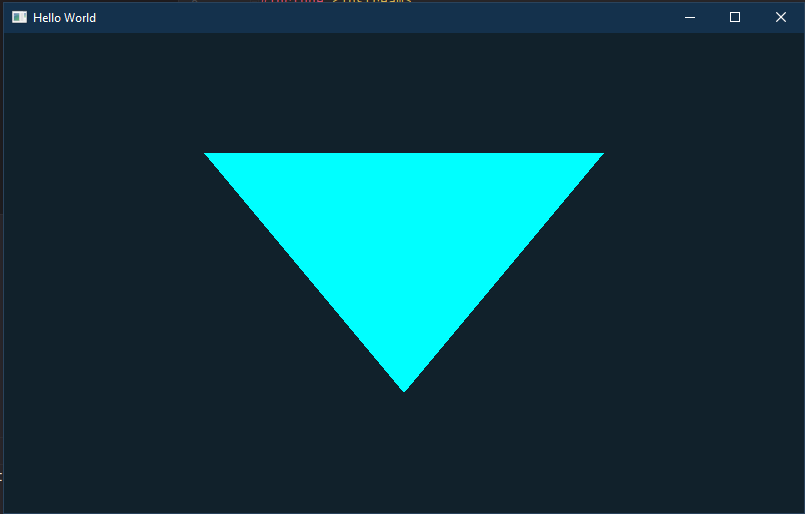

    
    <h1>AxolotlEngine</h1>

It is a new brand game engine made for learning purpose, it is another OpenGL powered game engine but it is aiming to evolve to Vulkan API in the future. The engine is IoC container based, we are looking to make the engine more extendable, following new modern convention. The engine is support ECS (entity component system) first, but other patterns can come out.

